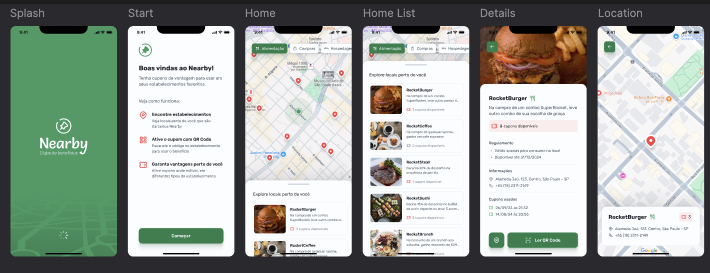

# Nearby Project

## Overview

The **Nearby** project is a mobile application and API designed to simulate a marketplace where users can find a variety of stores. It provides an intuitive interface for discovering businesses nearby and features seamless backend integration for managing store data.

---



---

## Prerequisites

Ensure the following tools are installed on your system before proceeding:

- **Node.js** (>= 18.x recommended)
- **Yarn** or **npm**
- **Expo CLI**
- **Prisma CLI**

---

## Mobile Application (Nearby)


### **Getting Started**

1. Clone the repository:
   ```bash
   git clone <repository-url>
   cd nearby

2.	Install dependencies:
    npm install

3. Start the project:
    npx expo start


###  BACK-END API

1.	Navigate to the API folder:
    cd api

2.	Install dependencies:
    npm install

3. Start the server:
    npm start